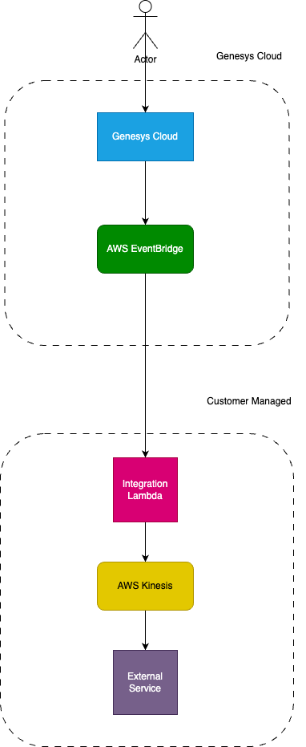

# Stream Conversation Details to AWS Kinesis

This blueprint outlines steps and advice on how to setup, use and customise the Genesys Cloud integration with AWS Kinesis.

# Table of Contents

* [Architecture Design Diagram](#architecture-design-diagram "Architecture Design Diagram")
* [Information Shared by default](#information-shared-by-default "Information Shared by default")
* [Setup](#setup "Setup")
* [Troubleshooting](#troubleshooting "Troubleshooting")
* [Definitions](#definitions "Definitions")
* [Documentation](#documentation "Documentation")

# Architecture Design Diagram



# Information Shared by default

The following table lists the information that is shared by default. 

| Name           | Type    | Description                                                                                                                                                         |
|----------------|---------|---------------------------------------------------------------------------------------------------------------------------------------------------------------------|
| conversationId | UUID    | The unique identifier for the conversation.                                                                                                                         |
| customerId     | UUID    | The unique identifier of the customer involved in the conversation. Acquired via the address in CustomerStartEvent.                                                 |
| direction      | String  |                                                                                                                                                                     |
| duration       | Long    | How long the conversation lasted, in milliseconds                                                                                                                   |
| mediaType      | Enum    | The media type of the conversation.                                                                                                                                 |
| provider       | String  |                                                                                                                                                                     |
| sessionId      | UUID    | The unique identifier for the session associated with the conversation.                                                                                             |
| timeStamp      | Long    |                                                                                                                                                                     |
| topicName      | String  | The topic of the conversation - specifically the notification topic of the event.                                                                                   |
| version        | Integer |                                                                                                                                                                     |

# Setup

Remember to [clone the repository](https://github.com/GenesysCloudBlueprints/genesys-cloud-event-streaming-blueprint) to get access to the sample lambda.

## Pre-requirements

1. Admin access to Genesys Cloud
2. Admin access to Amazon Web Services
3. Java 11+
4. Apache Maven tools
5. npm
6. jq or base64

## Genesys Cloud EventBridge Integration

The first step to make the integration between Genesys Cloud and AWS Kinesis work is to set up integration with AWS
EventBridge for sending the events. Each time a conversation event is generated, the integration will send the event 
from Genesys Cloud to the customers AWS account.


1.  Login into Genesys Cloud. Go to Admin → Integration, click '+' button  to add an integration, select
    'Amazon EventBridge Source'. The screen similar to the screenshot above will be opened

2.  'AWS Account ID' and 'AWS Account Region' fields can be found by login into AWS console → click link with
    account name in the top right corner


3.  'Event Source Suffix' can be any string (it is better to avoid spaces and special characters). This value will be
    used as a name of EventBridge bus in AWS, so it should be meaningful and unique per AWS account

4.  'Topic Filtering' are the topics used to stream data from to AWS EventBridge. For conversation events it should
    be at least 'v2.detail.events.conversation.{id}.customer.end' and 'v2.detail.events.conversation.{id}.customer.start'.
    List of available topics for the integration can be found here:
    <https://developer.genesys.cloud/api/rest/v2/notifications/available_topics>

5. If you want to use wrap-up names and other data in your external service, you should include topics
   relating to the data you want now, as seen in the Available Topics list above.

Steps above are enough but in case of any problems the comprehensive instruction on how to set up the integration can be
found [here](https://help.mypurecloud.com/articles/configure-the-amazon-EventBridge-integration/), this is a good starting
point for troubleshooting.

### Testing

Once the integration toggle switched into 'Enabled' position, there is no error icon right to it and a toast message
appears with confirmation that the integration established successfully. Apart from that, the new event bus is created
for AWS EventBridge (see explanation below).

## AWS SQS Dead Letter Queue

If an error happens on conversation event processing, this conversation event should not be lost. It should be stored somewhere,
analysed by a developer to identify a root cause of the problem and reprocessed again after the root cause is fixed.
This architecture pattern is called 'Dead Letter Queue' (DLQ) and it can be implemented in different ways. As a part of 
this blueprint, implementation based on AWS SQS is suggested.

1. Login AWS web console, find SQS (Simple Queue Service) service
2. Click 'Create queue' button
3. Type: Standard (FIFO queues are not supported as fallback destination in AWS Lambda)
4. Visibility timeout: must be longer than timeout of AWS Lambda (see below), use 900 seconds value if you are not sure 
5. Message retention period: 14 days 
6. Leave all other parameters as is

## AWS Kinesis Data Streams

AWS Kinesis Data Stream (further AWS Kinesis or just Kinesis) is a cloud service for streaming huge amounts of events in
real time. Here is a brief introduction into the service:
<https://aws.amazon.com/kinesis/data-streams/?nc=sn&loc=2&dn=2>

1. Login into AWS web console, open 'Kinesis' service.
2. Click 'Create Data Stream' button.
3. Enter a name of the data stream, which will be used to read data from your external service. The other parameters can be 
left default or set according to the desired throughput.


## AWS IAM

The last step in AWS configuration is creating users for the external service. To read data from AWS, the external
service must have access to particular AWS resources and only to them. This is the minimal list of permissions the
external service user should be granted with:

    kinesis:GetShardIterator
    kinesis:GetRecords
    kinesis:DescribeStream
    kinesis:ListStreams

These permissions allow the user to read from a specific Kinesis stream and get names of all Kinesis streams in the AWS
account.

Before creating a user, the following IAM policy must be created.
AEP user permissions

  {
    "Version": "2012-10-17",
    "Statement": [
      {
        "Sid": "stmntServiceReadFromTestKinesisStream",
        "Effect": "Allow",
        "Action": [
          "kinesis:GetShardIterator",
          "kinesis:GetRecords",
          "kinesis:DescribeStream"
        ],
        "Resource": "<KINESIS_ARN>"
      },
      {
        "Sid": "stmntServiceListAllKinesisStreams",
        "Effect": "Allow",
        "Action": "kinesis:ListStreams",
        "Resource": "*"
      }
    ]
  }

Using the policy, the user can be created:

1. On the left menu of 'AWS IAM' screen, click 'Users', then click 'Add users' button
2. Enter a meaningful username unique per account. Select 'Access Key - Programmatic access' credentials type
3. Click Next
4. On 'Permissions' screen, select 'Attach existing policies directly' and select newly created policy for access to
   the Kinesis stream
5. Click 'Next'
6. Tags can be skipped
7. Click 'Next'
8. Review the parameters and click 'Create user' button. As result, Access and Secret keys will be shown on the screen.
   It is necessary to save them now, they will cannot be retrieved further.

## AWS Lambda

To stream the conversation events from EventBridge to Kinesis, we require a lambda in the middle that will consume the
events from EventBridge, process them and send them onto Kinesis - which will handle sending them onwards to your
external service.

Included in [our repository](https://github.com/GenesysCloudBlueprints/genesys-cloud-event-streaming-blueprint) is a sample Lambda function. A customer will have to deploy it to their AWS account.

If the customer wishes to build their own, in high level terms they will have to:

1. Consume ScheduledEvents from EventBridge.
2. Check that the event is one of the ADE events to be consumed.
3. Process the event and create a Kinesis record, based off the data that needs to be consumed within the
   external service.
4. Send the Kinesis record out to the required Kinesis stream.

### Testing and Verify

AWS Lambda web console page shows number of invocations, how many of them were successful or failed and it is possible
to navigate to the related AWS Cloudwatch logs of the Lambda.

In addition, logs will be produced by the lambda. Depending on how your logging systems are set up, these logs should
be available to be processed and read elsewhere.

## AWS EventBridge

AWS EventBridge is a cloud service which works as a router for the events. Depending on the event's bus and schema
AWS EventBridge can route the event will be routed to the desired destination.

Here is a brief overview of the service: <https://docs.aws.amazon.com/EventBridge/latest/userguide/eb-what-is.html>

1.  Login into AWS web console

2.  Find 'EventBridge' using the search bar on the top. As result, Amazon EventBridge dashboard will be open

3.  On the left menu, click '[Partner event sources](https://us-east-1.console.aws.amazon.com/events/home?region=us-east-1#/partners)'

4.  Find the event bus with name ending with value of 'Event Source Suffix' set in the Genesys Cloud integration
    (see below).

    **If it does not exist then return to setting up the Genesys Cloud integration as that step was not successful.**

5.  Click 'Rules' on the left menu, as result 'Rules' page is open

6.  Click 'Create Rule' button

    1.  Name - any meaningful name of the rule

    2.  Event bus - the event bus with name ending with value of 'Event Source Suffix'

    3.  Toggle 'Enable the rule on the selected event bus' should be left in 'Enabled' position

    4.  Rule type should be used the default value 'Rule with an event pattern'

    5.  Click 'Next'

    6.  Event source - 'All events'

    7.  Sample event - skip

    8.  Event pattern - this is a filter, events which do not follow the  pattern will be filtered out. It is
        recommended to skip this value at the beginning and update it if necessary after making sure that the
        integration works correctly

    9.  Click 'Next'

    10. Now the target has to be configured. AWS EventBridge supports multiple target per bus, it is necessary to add
        the lambda introduced in one of the previous steps.

    11. Click Next

    12. Tags can be skipped

    13. Review the parameters and click 'Create' button

### Testing

Now it is necessary to make sure that the conversation events are flowing from Genesys Cloud to AWS Kinesis.

1.  Start and finish a test conversation

2.  Login to the AWS account, find Cloudwatch service on the top search bar

3.  On the left menu of Cloudwatch page, click 'All Metrics' under

4.  Search the stream metrics by Kinesis Stream name, select it

5.  Click 'Graphed metrics' tab, tick 'GetRecords.Success' metric. The graph should show non-zero value of the
    metric. Note that Cloudwatch needs up to 5 minutes to update the metric after the event is put into the stream

# Troubleshooting

## How to verify that the Kinesis stream is getting data?

In order to be able to set up the external service we need to see what the payload it's receiving from Kinesis is. You can do
this using the AWS CLI to read from the stream. Here are the example commands for the stream referred to above.

aws kinesis describe-stream --stream-name genesys-test-external-kinesis-stream --region us-east-1 |jq

```

{
    "Shards": [
        {
            "ShardId": "shardId-000000000000",
            "HashKeyRange": {
            "StartingHashKey": "0",
            "EndingHashKey": "340282366920938463463374607431768211455"
        }
    ]...
}

```

Note - you will have to choose a starting time close to when you know conversation data was sent or else you will have to iterate over empty gets until you find one
aws kinesis get-shard-iterator --shard-id shardId-000000000000 --shard-iterator-type TRIM_HORIZON --stream-name Foo --region us-east-1 
--timestamp 2022-03-25T09:35:00.480-00:00 | jq

```
{
    "ShardIterator": "AAAAAAAAAAHSywljv0zEgPX4NyKdZ5wryMzP9yALs8NeKbUjp1IxtZs1Sp+KEd9I6AJ9ZG4lNR1EMi+9Md/nHvtLyxpfhEzYvkTZ4D9DQVz/mBYWRO6OTZRKnW9gd+efGN2aHFdkH1rJl4BL9Wyrk+ghYG22D2T1Da2EyNSH1+LAbK33gQweTJADBdyMwlo5r6PqcP2dzhg="
}

```
aws kinesis get-records --shard-iterator AAAAAAAAAAHSywljv0zEgPX4NyKdZ5wryMzP9yALs8NeKbUjp1IxtZs1Sp+KEd9I6AJ9ZG4lNR1EMi+9Md/nHvtLyxpfhEzYvkTZ4D9DQVz/mBYWRO6OTZRKnW9gd+efGN2aHFdkH1rJl4BL9Wyrk+ghYG22D2T1Da2EyNSH1+LAbK33gQweTJADBdyMwlo5r6PqcP2dzhg= --region us-east-1 |jq

```
{
  "Records":[ {
    "Data":"dGVzdGRhdGE=",
    "PartitionKey":"123”,
    "ApproximateArrivalTimestamp": 1.441215410867E9,
    "SequenceNumber":"49544985256907370027570885864065577703022652638596431874"
  } ],
  "MillisBehindLatest":24000,
  "NextShardIterator":"AAAAAAAAAAEDOW3ugseWPE4503kqN1yN1UaodY8unE0sYslMUmC6lX9hlig5+t4RtZM0/tALfiI4QGjunVgJvQsjxjh2aLyxaAaPr+LaoENQ7eVs4EdYXgKyThTZGPcca2fVXYJWL3yafv9dsDwsYVedI66dbMZFC8rPMWc797zxQkv4pSKvPOZvrUIudb8UkH3VMzx58Is="
}

```

The data is base64 encoded, so you will have to decode it (using a tool like jq or base64).

# Definitions

Stitching is the process of enhancing streamed data with static data using matching properties.

# Documentation

[Genesys Cloud API -All available Analytics Detail Events and properties](https://developer.genesys.cloud/analyticsdatamanagement/analytics/detail/analytics-detail-events)

[Genesys Cloud API - Wrapup Code Mapping - Useful to get Wrapup Name via Wrapup Code Stitching](https://developer.genesys.cloud/devapps/api-explorer#get-api-v2-outbound-wrapupcodemappings)

[Genesys Cloud API - Queue Name](https://developer.genesys.cloud/devapps/api-explorer#get-api-v2-routing-queues)
