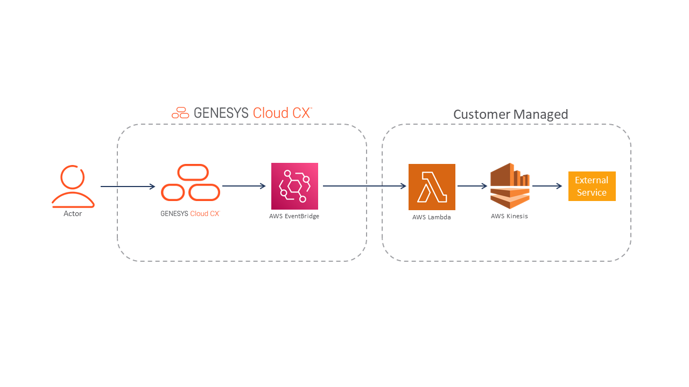
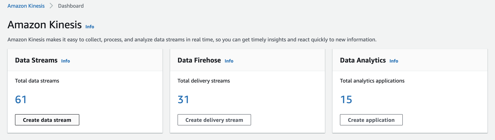

This Genesys Cloud Developer Blueprint explains how to set up, use, and customize Genesys Cloud integration with Amazon Kinesis.




## Solution components

* **Genesys Cloud** - A suite of Genesys cloud services for enterprise-grade communications, collaboration, and contact center management. Contact center agents use the Genesys Cloud user interface.
* **Amazon Web Services (AWS) Cloud** - A set of cloud computing capabilities managed by Amazon. Genesys Cloud events are sent to Amazon EventBridge.
* **AWS SQS** - A distributed message queuing service. It supports programmatic sending of messages via web service applications as a way to communicate over the Internet.
* **Amazon Kinesis** - A family of services provided by Amazon Web Services for processing and analyzing real-time streaming data at a large scale.
* **AWS IAM** - Identity and Access Management that controls access to AWS resources such as services or features.
* **AWS Lambda** - A serverless computing service for running code without creating or maintaining the underlying infrastructure.
* **Amazon EventBridge** - A scalable, serverless event bus that streams real-time data to selected targets based on custom routing rules.
* **Stitching** - Stitching is the process of enhancing streamed data with static data using matching properties.

## Prerequisites

### Specialized knowledge

* Administrator-level knowledge of Genesys Cloud
* Administrator-level knowledge of Amazon Web Services
* Knowledge of Java 11 or later versions
* Knowledge of using Apache Maven tools
* Working knowledge of npm
* Working knowledge of jq and Base64

### Genesys Cloud account

* A Genesys Cloud CX 1 license. For more information, see [Genesys Cloud Pricing](https://www.genesys.com/pricing "Opens the Genesys Cloud pricing article").
* The Master Admin role in Genesys Cloud. For more information, see the [Roles and permissions overview](https://help.mypurecloud.com/?p=24360 "Opens the Roles and permissions overview article") in the Genesys Cloud Resource Center.

### AWS account

* An administrator account with permissions to access these services:
  * AWS Identity and Access Management (IAM)
  * AWS EventBridge
  * AWS Lambda
  * AWS credentials

## Implementation steps

You can choose to implement the Genesys Cloud objects through the Genesys Cloud user interface or by using Terraform:
* [Configure Genesys Cloud and Amazon using Terraform](#configure-genesys-cloud-and-amazon-using-terraform)
* [Configure Genesys Cloud and Amazon manually](#configure-genesys-cloud-and-amazon-manually)

### Information Shared by default

The following table lists the information shared by default. 

| Name           | Type    | Description                                                                                                                                                         |
|----------------|---------|---------------------------------------------------------------------------------------------------------------------------------------------------------------------|
| conversationId | UUID    | The unique identifier for the conversation.                                                                                                                         |
| customerId     | UUID    | The unique identifier of the customer involved in the conversation. Acquired via the address in CustomerStartEvent.                                                 |
| direction      | String  |                                                                                                                                                                     |
| duration       | Long    | The length of the conversation in milliseconds.                                                                                                                   |
| mediaType      | Enum    | The media type of the conversation.                                                                                                                                 |
| provider       | String  |                                                                                                                                                                     |
| sessionId      | UUID    | The unique identifier for the session associated with the conversation.                                                                                             |
| timeStamp      | Long    |                                                                                                                                                                     |
| topicName      | String  | The topic of the conversation. Specifically, the notification topic of the event.                                                                                   |
| version        | Integer |                                                                                                                                                                     |

### Clone the GitHub repository

1. Clone the [genesys-cloud-event-streaming-blueprint](https://github.com/GenesysCloudBlueprints/genesys-cloud-event-streaming-blueprint "Goes to the genesys-cloud-event-streaming-blueprint") GitHub repository on your local machine.
2. Create a sample code for the AWS Lambda function:
    1. Clone the repository with the source code: `git clone <REPO_URL>`
    2. In a terminal window, change to the directory with the source code: `cd <PROJECT_ROOT>`
    3. Run the command `mvn clean verify -U`. This command downloads the dependencies, compiles, tests and packs everything in to a `jar` file.

After successful completion, the `jar` file is available at `<PROJECT_ROOT>/target/genesys-external-streaming-integration.jar` for you to upload to your AWS account.
  

## Configure Genesys Cloud and Amazon using Terraform

### Set up Genesys Cloud

Set the following environment variables in a terminal window before you can run this project using the Terraform provider:

 * `GENESYSCLOUD_OAUTHCLIENT_ID` - This variable is the Genesys Cloud client credential grant Id that CX as Code executes against. 
 * `GENESYSCLOUD_OAUTHCLIENT_SECRET` - This variable is the Genesys Cloud client credential secret that CX as Code executes against. 
 * `GENESYSCLOUD_REGION` - This variable is the Genesys Cloud region in your organization.
 * `AWS_ACCESS_KEY_ID` - The AWS Access Key you must set up in your Amazon account to allow the AWS Terraform provider to act against your account.
 * `AWS_SECRET_ACCESS_KEY` - The AWS Secret you must set up in your Amazon account to allow the AWS Terraform provider to act against your account.

Set the environment variables in the same directory that you run the Terraform commands. 

### Configure your Terraform build

Set the following values in the **/terraform/dev.auto.tfvars** file that are specific to your Genesys Cloud organization:

* `genesys_cloud_organization_id` - Your Genesys Cloud organization ID. In Genesys Cloud, you can navigate from **Admin** > **Organization Settings** > **Advanced** to get the ID.
* `aws_account_id` - The AWS Account ID associated with the event source creation.
* `aws_region` - The AWS region where the event source is made available for an event bus. For example, `us-east-1`.
* `aws_event_bus_name` - A unique name appended to the event source in the AWS account. The name can be up to 64 characters and includes lower or uppercase letters, numbers, and the special characters '.', '-', and '_'.
* `aws_sqs_queue_name` - The AWS SQS queue name.
* `aws_stream_name` - The AWS stream name.
* `aws_iam_poicy_name` - The AWS IAM policy name.
* `aws_iam_user_name` - The AWS IAM user name.
* `aws_iam_lambda_role_name` - The AWS IAM lambda role name.
* `aws_lambda_function_name` - The AWS lambda function name.
* `aws_eventbridge_name` - The AWS EventBridge name.

The following is an example of the `dev.auto.tfvars` file.

```
  genesys_cloud_organization_id = "genesys-cloud-org-id"
  aws_account_id                = "aws-account-id"
  aws_region                    = "aws-region"
  aws_event_bus_name            = "gc-event-streaming"
  aws_sqs_queue_name            = "gc-event-streaming-queue"
  aws_stream_name               = "gc-event-streaming-kinesis"
  aws_iam_poicy_name            = "gc-event-streaming-iam-policy"
  aws_iam_user_name             = "gc-event-streaming-iam-user"
  aws_iam_lambda_role_name      = "gc-event-streaming-iam-lambda"
  aws_lambda_function_name      = "gc-event-streaming-lambda"
  aws_eventbridge_name          = "gc-event-streaming-eventbridge"
```

### Run Terraform

You are now ready to run this blueprint solution in your organization. 

Change to the **/terraform** folder and run the following commands:

  * `terraform init` - This command initializes a working directory that contains the Terraform configuration files.

  * `terraform plan` - This command executes a trial run on your Genesys Cloud organization and displays the list of all the Genesys Cloud resources that are created. Ensure that you have reviewed this list before proceeding to the next step.

  * `terraform apply --auto-approve` - This command creates and deploys the necessary objects in your Genesys Cloud account. The `--auto-approve` flag provides the necessary approval before creating the objects.

After the `terraform apply --auto-approve` command completes, you can see all the objects that Terraform successfully created.

The project in this blueprint has the following assumptions:

  * The local state file in Terraform, named `terraform.tfstate`, is created and stored in the same folder as the project. Terraform recommends that you store the state file on a remote machine. However, you can run Terraform locally and comfortable with the deletion of the state file.
  * To clean up the org and remove all the objects that are managed by the local Terraform state file, you use the `terraform destroy --auto-approve` command from the `blueprint/terraform` directory. Ensure that you have backed up your projects before deleting the projects.
  

## Configure Genesys Cloud and Amazon manually

### Genesys Cloud EventBridge Integration

To make the connection between Genesys Cloud and Amazon Kinesis, set up the Amazon Eventbridge integration for sending the events. Each time a conversation event is generated, the integration sends the event from Genesys Cloud to the AWS account of the customers.

1. Log in to Genesys Cloud. 
2. Navigate to **Admin** > **Integration**.
3. Click **Add Integration**.
4. In the Search box, type EventBridge and select **Amazon EventBridge Source**.
5. Click **Install**. Details about the integration appear.
6. In the **Details** tab, accept the default name (Amazon EventBridge Source) or type a different name.
7. Select the **Configuration** tab.

8. Enter your 12-digit AWS account ID and the region where to create the partner event source. You can get the AWS account details from the AWS console.

9. Enter a unique **Event Source Suffix** name to append to the event source in the AWS account as it is used as the name of the EventBridge bus in the AWS. Avoid spaces and special characters in the string.
10. In **Topic Filtering**, select the notification topics that you want to send to EventBridge. For conversation events, it must be at least `v2.detail.events.conversation.{id}.customer.end` and `v2.detail.events.conversation.{id}.customer.start`. For more information about the list of available topics for the integration, see [Available Topics](https://developer.genesys.cloud/api/rest/v2/notifications/available_topics "Opens the Available topics") in Genesys Cloud Developer Center.
You can include other topics that you want from the Available topics list. For example, you can use wrap-up names and other data in your external service.
11. Click **Save** and activate the integration.
For more information, see [Configure the Amazon EventBridge integration](https://help.mypurecloud.com/articles/configure-the-amazon-EventBridge-integration/ "Opens the Configure the Amazon EventBridge integration article") in Genesys Cloud Resource Center.


### Test the integration

Upon successful activation of the integration, a confirmation message displays that the integration is activated. This process creates an event bus for Amazon EventBridge.

### Create Amazon Simple Queue Service (Amazon SQS) dead-letter queues

When an error occurs in processing a conversation event, the affected event must be persisted to prevent data loss. The persistence of the event facilitates root cause analysis of the issue. After the issue is resolved, the stored event can be reprocessed.
This architecture pattern, called as dead-letter queues (DLQs), can be implemented in different ways. This blueprint describes the implementation based on Amazon SQS.

1. Log in to AWS web console and search for Simple Queue Service.
2. Click **Create queue**.
3. For **Type**, select the **Standard** queue type. The FIFO queues are not supported as a fallback destination in AWS Lambda.
4. The console sets default values for the queue configuration parameters. Under **Configuration**, you can set new values for the following parameters:
    * For the **Visibility timeout**, enter a value that is longer than the timeout of AWS Lambda or use 900 seconds as value if you are unsure.
    * For the **Message retention period**, enter 14 days as the value.
5. Retain the default values for other options and click **Create queue**.

### Create Amazon Kinesis Data Streams

Amazon Kinesis Data Streams is a real-time streaming cloud service for handling large volumes of events data streams. For more information, see [Amazon Kinesis Data Streams](https://aws.amazon.com/kinesis/data-streams/?nc=sn&loc=2&dn=2 "Opens the Amazon Kinesis Data Streams page") in AWS.

1. Log in to the AWS web console and open the Kinesis console.
2. Click **Create Kinesis stream**.
3. Enter a name for the data stream that will be used to read the data from your external service.
4. Either retain the default parameters or set the values according to the desired throughput.
  

    

### Create users in AWS IAM

The last step in the AWS configuration is to create users for the external service. To read data from the AWS, the external service must have access only to the particular AWS resources. Grant the external service user with these minimum permissions:

    kinesis:GetShardIterator
    kinesis:GetRecords
    kinesis:DescribeStream
    kinesis:ListStreams

These permissions allow the user to read from a specific Kinesis stream and get the names of all the Kinesis streams in the AWS account.

Before creating a user, create the following IAM policy:

```json
  {
    "Version": "2012-10-17",
    "Statement": [
      {
        "Sid": "stmntServiceReadFromTestKinesisStream",
        "Effect": "Allow",
        "Action": [
          "kinesis:GetShardIterator",
          "kinesis:GetRecords",
          "kinesis:DescribeStream"
        ],
        "Resource": "<KINESIS_ARN>"
      },
      {
        "Sid": "stmntServiceListAllKinesisStreams",
        "Effect": "Allow",
        "Action": "kinesis:ListStreams",
        "Resource": "*"
      }
    ]
  }
```

To create a user using the policy:

1. Open the IAM console of the AWS console.
2. Select the Users menu from the left side of the screen and click **Add User**.
3. Enter a unique name for the user account.
4. Select **Programmatic access** under Access type and click **Next: Permissions**.
5. Click **Attach existing policies directly** and select the newly created policy to access the Kinesis stream.
6. Click **Next: Tags**.
7. You can skip the tag section and review the selections.
8. Click **Create User** to finish the user setup.

AWS provides the user with an Access key ID and Secret access key. Download or copy these keys for later use.

### Create an AWS Lambda function

An AWS Lambda function can be interposed between Amazon EventBridge and Amazon Kinesis to facilitate the streaming of events. The lambda function acts as an event processor, receives events from Amazon EventBridge, processes the events, and forwards them to Amazon Kinesis for delivery to your external service.

This blueprint solution includes a [sample lambda function](https://github.com/GenesysCloudBlueprints/genesys-cloud-event-streaming-blueprint "Opens the lambda function in the GitHub repository") that you can deploy it in your AWS account.

An outline to create your own AWS Lambda function:

1. Receive the ScheduledEvents from Amazon EventBridge.
2. Check that the received event is one of the ADE events.
3. Process the event and create a Amazon Kinesis record, which is compatible with the external service requirements.
4. Send the Amazon Kinesis record to the required stream.

### Test and verify the setup

The AWS Lambda web console page shows the number of invocations and how many of them were successful or failure. You can navigate to the related AWS Cloudwatch logs of the lambda functions.

The lambda functions produce the logs. The availability of these logs for external processing and analysis depends on your specific logging configuration.

### Configure Amazon EventBridge to receive events from Genesys Cloud integration

Amazon EventBridge is a cloud service, which works as a router for the events. Depending on the event's bus and schema, Amazon EventBridge can route the event to the desired destination.

For more information about the service, see [What is Amazon EventBridge?](https://docs.aws.amazon.com/eventbridge/latest/userguide/eb-what-is.html "Opens the Amazon EventBridge documentation")

1. Log in to the AWS web console.
2. Search for EventBridge and open the dashboard.
3. Click **Partner event sources**.
4. Search for an **Event bus** that ends with the value of Event Source Suffix set in the Genesys Cloud integration.

    :::primary
    **Note**: If the event bus doesn't exist, the setup in Genesys Cloud integration is not successful and must be set up again.
    :::
5. Select **Rules** in the left menu and click **Create Rule**.
6. Enter a name and description for the rule.
7. For **Event bus**, choose the event bus that ends with the value of **Event Source Suffix**.
8. For **Enable the rule on the selected event bus**, retain the default selection to **Enabled**.
9. For **Rule type**, select **Rule with an event pattern** and click **Next**.
10. For **Event source**, select **All Events**.
11. Skip the **Sample events** and **Event pattern**. Event pattern is a filter the events that do not follow the pattern. You can update it later after you ensure that the integration works.
12. Click **Next**.
13. For **Target types**, select **AWS service**.
14. For **Select a target**, choose the lambda function created previously. Amazon EventBridge supports multiple targets per bus.
15. Click **Next**.
16. You can skip the tags for the rule. Review the rule details and click **Create rule**.

### Test the events flow

To ensure that the conversation events flow from Genesys Cloud to Amazon Kinesis:

1. Start and finish a test conversation.
2. Log in to the AWS console and search for Cloudwatch service.
3. Navigate to **Metrics** > **All metrics**.
4. Select the stream metrics for Kinesis stream name and choose the stream.
5. Select the **Graphed metrics** tab and select **GetRecords.Success** metric. The graph shows the non-zero value of the metric.
:::primary
**Note**: Cloudwatch service requires atleast 5 minutes to update the metric after the event is put in to the stream.

## Troubleshooting

### Verify that the Kinesis stream gets data

To set up the external service, check the payload that it receives from the Amazon Kinesis stream. To read from the stream, use the following commands from the AWS CLI:

```
  {   
    "title":"aws kinesis describe-stream --stream-name genesys-test-external-kinesis-stream --region us-east-1 |jq", "language": "json", 
    "tabsToSpaces": 2, "showLineNumbers": true, "highlight": "3-5,7" 
  }
{
    "Shards": [
        {
            "ShardId": "shardId-000000000000",
            "HashKeyRange": {
            "StartingHashKey": "0",
            "EndingHashKey": "340282366920938463463374607431768211455"
        }
    ]...
}
```
:::primary
**Note:** Choose a start time approximately when the conversation data was sent or you have to iterate over empty data sets to search.
:::
To get the shard iterator, use the following command:

``` 
    { 
      "title":"aws kinesis get-shard-iterator --shard-id shardId-000000000000 --shard-iterator-type TRIM_HORIZON --stream-name Foo --region us-east-1 --timestamp 2022-03-25T09:35:00.480-00:00 | jq", 
      "language": "json", "tabsToSpaces": 2, "showLineNumbers": true, "highlight": "3-5,7" 
    }
```
A sample output of the command:
```
  {
    "ShardIterator": "AAAAAAAAAAHSywljv0zEgPX4NyKdZ5wryMzP9yALs8NeKbUjp1IxtZs1Sp+KEd9I6AJ9ZG4lNR1EMi+9Md/nHvtLyxpfhEzYvkTZ4D9DQVz/mBYWRO6OTZRKnW9gd+efGN2aHFdkH1rJl4BL9Wyrk+ghYG22D2T1Da2EyNSH1+LAbK33gQweTJADBdyMwlo5r6PqcP2dzhg="
}
```
To get the record details, use the following command:

```
  { 
    "title":"aws kinesis get-records --shard-iterator AAAAAAAAAAHSywljv0zEgPX4NyKdZ5wryMzP9yALs8NeKbUjp1IxtZs1Sp+KEd9I6AJ9ZG4lNR1EMi+9Md/nHvtLyxpfhEzYvkTZ4D9DQVz/mBYWRO6OTZRKnW9gd+efGN2aHFdkH1rJl4BL9Wyrk+ghYG22D2T1Da2EyNSH1+LAbK33gQweTJADBdyMwlo5r6PqcP2dzhg= --region us-east-1 |jq", "language": "json", 
    "tabsToSpaces": 2, "showLineNumbers": true, "highlight": "3-5,7" 
  }
```
A sample output of the command:
```
  {
    "Records":[ {
      "Data":"dGVzdGRhdGE=",
      "PartitionKey":"123”,
      "ApproximateArrivalTimestamp": 1.441215410867E9,
      "SequenceNumber":"49544985256907370027570885864065577703022652638596431874"
      } ],
    "MillisBehindLatest":24000,
    "NextShardIterator":"AAAAAAAAAAEDOW3ugseWPE4503kqN1yN1UaodY8unE0sYslMUmC6lX9hlig5+t4RtZM0/tALfiI4QGjunVgJvQsjxjh2aLyxaAaPr+LaoENQ7eVs4EdYXgKyThTZGPcca2fVXYJWL3yafv9dsDwsYVedI66dbMZFC8rPMWc797zxQkv4pSKvPOZvrUIudb8UkH3VMzx58Is="
  }
```

The data is base64 encoded and you have to decode it using tools such as, jg or base64.

## Additional resources

* The [genesys-cloud-event-streaming-blueprint](https://github.com/GenesysCloudBlueprints/genesys-cloud-event-streaming-blueprint  "Opens the genesys-cloud-event-streaming-blueprint repository in GitHub") repository in GitHub
* [AWS EventBridge Documentation](https://docs.aws.amazon.com/eventbridge/?id=docs_gateway "Opens the AWS EventBridge documentation") in the AWS Documentation Center
* [Analytics Detail Events](https://developer.genesys.cloud/analyticsdatamanagement/analytics/detail/analytics-detail-events "Opens the Analytical Detail Events") in the Genesys Cloud Developer Center
* [Genesys Cloud API - Wrap-up Code Mapping - Useful to get Wrap-up Name via Wrap-up Code Stitching](https://developer.genesys.cloud/devapps/api-explorer#get-api-v2-outbound-wrapupcodemappings:~:text=Outbound-,GET,-/api/v2/outbound "Opens the wrapup code mapping in Genesys Cloud Public API") in the Genesys Cloud Developer Center
* [Genesys Cloud API - Queue Name](https://developer.genesys.cloud/devapps/api-explorer#get-api-v2-routing-queues "Opens the routing queues in Genesys Cloud API) in the Genesys Cloud Developer Center")